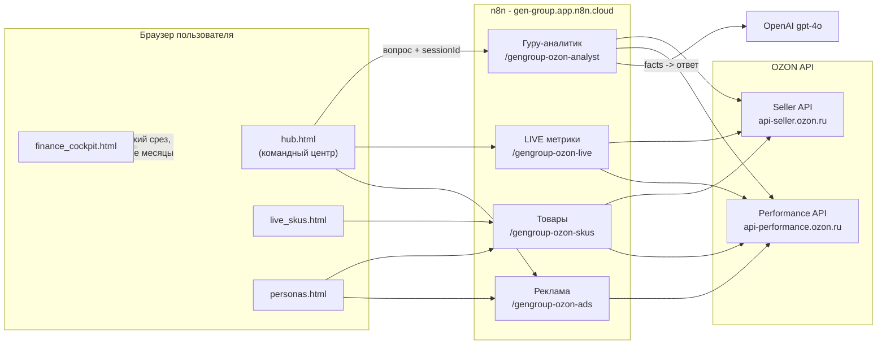
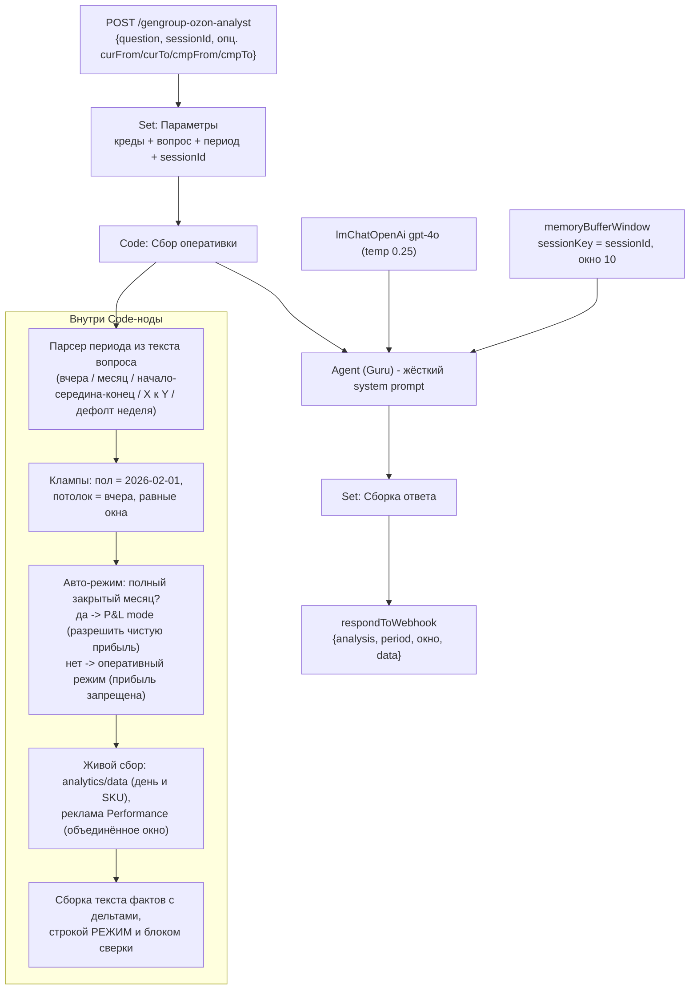

# DOC_01 - Архитектура (как построено)

Версия: 1.0 - Июнь 2026

---

## 1. Обзор архитектуры

Система построена по принципу "тонкий фронт - умный вебхук - живой источник". Никакой собственной базы данных нет: каждый запрос с дашборда идёт в n8n, n8n в реальном времени дёргает OZON API, агрегирует и отдаёт JSON. Это даёт максимальную свежесть и нулевую стоимость хранения, ценой того, что каждый запрос платит латентностью обращения к OZON (от 5 до 20 секунд на сложных запросах).

---

## 2. Слои данных

Это центральная концепция системы. Их три, и они не смешиваются.

### 2.1 Оперативный слой (свежесть T-1)

Источник: OZON Seller API `/v1/analytics/data` + Performance API. Это GMV, заказы, показы, корзина, доставки, возвраты, отмены, рекламный расход, ДРР, индекс цен, остатки. Доступно по вчерашний день. Это НЕ прибыль - это оборот и воронка.

### 2.2 Сверенный финансовый слой (лаг около месяца)

Источник: подписанные Акты сверки OZON (чистая прибыль разнесена по месяцам). На момент написания закрыты февраль, март, апрель 2026. Это факт для решений по деньгам.

Значения `[ДАННЫЕ]`:
- Февраль 2026: чистая прибыль -0.37М при реализации 1.20М.
- Март 2026: +1.26М при реализации 8.97М.
- Апрель 2026: +3.84М при реализации 14.66М.

### 2.3 Модельный слой (DEPRECATED)

Расчётные ряды в `sales_skus.html` (себестоимость по производственной модели, дневные сплиты). Помечен предупреждением, от навигации хаба отцеплён. Под снос - см. ТЗ.

---

## 3. Гуру-аналитик: внутренняя логика

Это не "обёртка над ChatGPT". Это конвейер: разбор намерения -> сбор живых фактов -> генерация ответа моделью с жёсткими правилами.

Ключевые свойства:
- **Period-aware.** Агент отвечает за тот период, который спросили ("сравни начало июня к маю" -> 1-4 июня против 1-4 мая, равные окна), а не за дефолтный.
- **Авто-режим.** Если запрошен полный закрытый месяц (февраль/март/апрель целиком) - агент переходит в режим P&L и называет чистую прибыль из сверки как `[ДАННЫЕ]`. Иначе - оперативный режим, прибыль не называется.
- **Память.** В пределах одной сессии (`sessionId`) агент помнит предыдущие вопросы и ответы; на "а почему так?" отвечает в контексте.
- **Жёсткие правила в system prompt.** Метки `[ДАННЫЕ]`/`[ГИПОТЕЗА]`, запрет на длинное тире, флаг VIOLUR/перегородки как нарушение, фиксированный формат ответа (Вердикт, Что произошло, Разбор, Риски, Задачи P1-P3 с ответственными).

---

## 4. Поток "дашборд - агент"

В хабе панель Гуру:
1. Генерирует `sessionId` один раз на загрузку страницы (`hub-<timestamp>-<rnd>`).
2. На каждый вопрос шлёт `{question, sessionId}`; если в вопросе нет слова-времени (месяц/неделя/вчера и т.п.) - добавляет `curFrom/curTo/cmpFrom/cmpTo` из выбранного в панели месяца, иначе период парсится из текста.
3. Для закрытого месяца выбор через переключатель автоматически включает режим P&L.

---

## 5. Решения, заложенные в архитектуру

| Решение | Почему | Цена/риск |
|---|---|---|
| Нет своей БД, живой вызов OZON на каждый запрос | Максимальная свежесть, нулевое хранение, быстрый запуск | Латентность 5-20 с; нет истории за пределами OZON; нагрузка на лимиты OZON |
| Логика в Code-нодах n8n (JS) | Быстро итерировать без отдельного бэкенда | Код в нодах, не в Git; нет юнит-тестов; секреты в нодах |
| Статические HTML-дашборды | Ноль билда, открываются как файл, легко отдать | Нет компонентной переиспользуемости, нет авторизации, состояние в памяти страницы |
| Один AI-провайдер (OpenAI) | В n8n заведён только ключ OpenAI | Вендор-лок; смена модели требует ключа |
| Память агента - буфер в n8n по sessionId | Просто, работает в пределах сессии | Память не персистентная между перезапусками воркфлоу |

Эти решения сознательны для быстрого запуска. ТЗ на пересборку (`TZ_REBUILD_CLAUDE_CODE.md`) снимает каждое из них.
