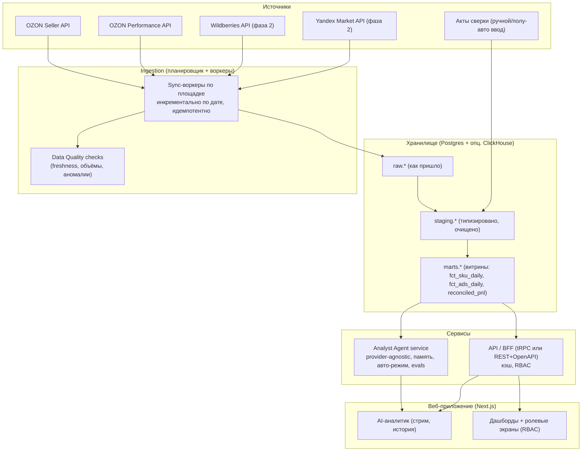

# ТЗ: пересборка GENGROUP Marketplace Analytics с нуля в Claude Code

Версия: 1.0 - Июнь 2026
Статус: проект для исполнения
Заказчик: Иван Раюшкин (CMO GENGROUP), решения по архитектуре - Богдан Валайко (CEO)
Исполнитель: Claude Code

Это ТЗ описывает, как собрать систему заново - не "переписать дашборды", а построить промышленную, масштабируемую аналитическую платформу маркетплейсов для всего холдинга (5 брендов, несколько площадок, несколько юрлиц), с правильным хранилищем, типизированным API, провайдер-агностичным AI-аналитиком, ролевым доступом, тестами и CI/CD. Текущая реализация на n8n остаётся как ориентир по бизнес-логике (см. `DOC_01..DOC_04`).

---

## 0. Принципы (нефункциональные требования, нерушимые)

1. **Два слоя данных раздельно.** Оперативный слой (GMV, воронка, реклама, индекс цен, склад) и сверенный финансовый слой (чистая прибыль по подписанным Актам) никогда не смешиваются. Прибыль за незакрытый период не вычисляется.
2. **Provenance на каждой цифре.** Любое число в API и в ответах агента несёт метку `[ДАННЫЕ]` или `[ГИПОТЕЗА]`. Это enum в типах, не комментарий.
3. **Защита позиционирования брендов.** Бренд VALONTI не должен быть на маркетплейсах. Появление в данных - автоматический флаг нарушения. VIOLUR - столы GENGLASS, продаются на МП легально (правка Ивана, июнь 2026; прежняя версия ошибочно относила VIOLUR к перегородкам).
4. **Типографика.** Длинное тире запрещено во всех текстах и UI. Только дефис. Линтер проверяет.
5. **Секреты только в vault.** Ни одного ключа в коде, в нодах, в репозитории. Нарушение блокирует CI.
6. **Провайдер-агностичный AI.** OpenAI, Anthropic, Gemini за единым интерфейсом. Смена провайдера - переменная окружения, не переписывание.
7. **Воспроизводимость.** Любой запуск ETL идемпотентен; пересчёт за дату даёт тот же результат.
8. **Тестируемость.** Бизнес-логика покрыта юнит-тестами; ответы агента - регрессионным golden-набором.

---

## 1. Целевая архитектура



Принципиальное отличие от текущей системы: данные сначала кладутся в хранилище инкрементально, а API и агент читают из хранилища, а не дёргают OZON на каждый клик. Это даёт историю, скорость (миллисекунды вместо секунд), устойчивость к лимитам OZON и возможность сложной аналитики.

---

## 2. Технологический стек (с обоснованием)

| Слой | Выбор | Почему |
|---|---|---|
| Язык | TypeScript end-to-end | Один язык на фронт/бэк/ETL, общие типы, лучший DX в Claude Code |
| Монорепо | pnpm workspaces + Turborepo | Общие пакеты, кэш билдов, единый CI |
| Хранилище | PostgreSQL (основное) + ClickHouse (опц., для тяжёлой аналитики) | Postgres - надёжно и просто; ClickHouse - когда объёмы вырастут |
| ORM/миграции | Drizzle ORM + drizzle-kit | Типобезопасные схемы и миграции в TS |
| Трансформации | dbt-подобный слой на SQL или Drizzle-вьюхи | Воспроизводимые витрины raw -> staging -> marts |
| API | tRPC (внутренний) + опц. OpenAPI для внешних | Сквозная типизация фронт-бэк без кодогена |
| Валидация | Zod (схемы запросов/ответов и DTO) | Единый источник типов и рантайм-валидация |
| AI-провайдеры | Vercel AI SDK или собственная абстракция | OpenAI/Anthropic/Gemini за одним интерфейсом |
| Фронт | Next.js (App Router) + React + Tailwind | SSR/ISR, ролевые маршруты, быстрый UI |
| Графики | Recharts или visx | Достаточно для дашбордов |
| Auth | Auth.js (NextAuth) или Clerk + RBAC | Логин и роли (персоны как роли) |
| Очереди/расписание | node-cron + BullMQ (Redis) или Temporal | Надёжные инкрементальные синки и ретраи |
| Кэш | Redis | Кэш ответов API и промежуточных агрегатов |
| Наблюдаемость | OpenTelemetry + Sentry + структурные логи (pino) | Трассировка, ошибки, метрики |
| Качество данных | кастомные DQ-проверки или Great Expectations | Freshness, объёмы, аномалии |
| Тесты | Vitest (юнит/интеграция) + Playwright (e2e) + agent evals | Полное покрытие |
| CI/CD | GitHub Actions + Vercel (web) + контейнеры (сервисы) | Превью-деплои, автотесты |
| IaC | Terraform | БД, Redis, секреты, окружения как код |
| Секреты | Doppler / Vault / GitHub OIDC + cloud secrets | Ни одного ключа в коде |

Замечание: стек можно адаптировать под имеющуюся инфраструктуру холдинга (например, Python для ETL, если команда сильнее в Python). Принципы важнее конкретных библиотек.

---

## 3. Структура монорепозитория

```
gengroup-analytics/
  CLAUDE.md                      # инструкции для Claude Code (см. раздел 13)
  README.md
  turbo.json
  pnpm-workspace.yaml
  .github/workflows/ci.yml
  infra/                         # Terraform (Postgres, Redis, секреты, окружения)
  packages/
    shared/                      # zod-схемы, типы, enum Provenance, бренд-конфиг, утилиты дат
    db/                          # Drizzle схема, миграции, сиды, клиент
    connectors/                  # клиенты площадок: ozon-seller, ozon-performance, (wb, yandex)
    ingestion/                   # sync-воркеры, расписание, backfill, DQ-проверки
    transforms/                  # staging -> marts (SQL/dbt-подобные модели)
    agent/                       # analyst-сервис: провайдеры, контекст-билдер, память, авто-режим, evals
    api/                         # tRPC роутеры, RBAC, кэш
  apps/
    web/                         # Next.js: дашборды, ролевые экраны, AI-чат
    worker/                      # запуск ingestion-воркеров и планировщика
  evals/
    golden/                      # golden-набор вопрос-эталон для агента (см. раздел 7.4)
  docs/                          # перенос DOC_00..DOC_04 + ADR
```

---

## 4. Модель данных (обобщённая на холдинг)

Ключевая идея: всё параметризовано брендом, площадкой и аккаунтом, чтобы добавление WB/Yandex или нового бренда не ломало схему.

### 4.1 Измерения (staging/marts)
- `dim_brand` - `brand_id, code (GENGLASS|VALONTI|GENTERO|METAL_GM|GLASS_MEMORY), legal_entity`.
- `dim_marketplace` - `marketplace_id, code (OZON|WB|YANDEX)`.
- `dim_account` - `account_id, marketplace_id, external_client_id`.
- `dim_sku` - `sku_id, account_id, offer_id, name, line, brand_id, is_marketplace_allowed (для флага VIOLUR/VALONTI)`.
- `dim_campaign` - `campaign_id, account_id, title, state, object_type`.

### 4.2 Факты (marts)
- `fct_sku_daily` - `date, sku_id, revenue, ordered_units, views, to_cart, delivered, returns, cancellations`.
- `fct_ads_daily` - `date, account_id, campaign_id, sku_offer_id, spent, orders, orders_money, views, clicks`.
- `snap_price_index` - `date, sku_id, price_index_value, color_index`.
- `snap_stock` - `date, sku_id, present, reserved, available`.
- `reconciled_pnl` - `period_month, brand_id, account_id, realization, net_profit, source='signed_act', confidence='DATA'` (только закрытые месяцы).

### 4.3 Сырой слой
- `raw.ozon_analytics_daily`, `raw.ozon_stocks`, `raw.ozon_prices`, `raw.ozon_finance_tx`, `raw.ozon_perf_stats`, `raw.ozon_campaigns` - сохраняют ответ как пришло (jsonb + дата загрузки) для воспроизводимости и переразбора.

### 4.4 Provenance в типах
```ts
// packages/shared/provenance.ts
export type Provenance = "DATA" | "HYPOTHESIS";
export interface Metric<T = number> {
  value: T;
  provenance: Provenance;
  assumption?: string;   // обязательно для HYPOTHESIS
  source?: string;       // 'ozon_analytics' | 'signed_act' | ...
}
```

### 4.5 Правила витрин
- ДРР: суммарный по аккаунту считается; по линиям помечается как ориентир из-за расхождения таксономий (offer-id против названия) - в витрине поле `ads_by_line_reliable: boolean = false`.
- Пол данных по аккаунту хранится в `dim_account.data_floor` (для GENGLASS OZON = 2026-02-01).
- OOS - производное: `ordered_units > 0 AND available <= 0`.

---

## 5. Ingestion (ETL)

Требования:
1. **Инкрементально по дате.** Синк за период `[from, to]`, по умолчанию вчера. Бэкфилл по диапазону.
2. **Идемпотентность.** Upsert по натуральному ключу (`date + sku_id` и т.п.). Повтор за дату не плодит дубли.
3. **Бэкфилл от пола данных.** Стартовая загрузка GENGLASS OZON с `2026-02-01` по вчера.
4. **Устойчивость.** Ретраи с экспоненциальной паузой, обработка лимитов OZON, чекпойнты по дате.
5. **Коннекторы изолированы.** `packages/connectors/ozon-seller`, `ozon-performance` - чистые клиенты с типизированными методами; знают про подводные камни (хост `api-performance.ozon.ru`, OAuth-токен на 1800 с, десятичная запятая, батч кампаний по 25, пагинация stocks по `last_id`, prices по `cursor`).
6. **Расписание.** Ежедневный синк за вчера + догон пропусков. Снапшоты цен и остатков - ежедневно (это временные ряды).
7. **DQ-проверки** после синка: свежесть (есть ли данные за вчера), объём (не упал ли резко), аномалии (выбросы), нулевые дни ниже пола - ожидаемы.

Реализация коннекторов переносит проверенную логику из `DOC_02` и Code-нод n8n, но как тестируемый TypeScript с моками.

---

## 6. API / BFF

- **tRPC-роутеры** поверх витрин: `skus.list`, `skus.byLine`, `funnel.get`, `ads.summary`, `ads.burners`, `pnl.reconciled`, `priceIndex.distribution`, `oos.list`.
- **Контракты** - Zod-схемы из `packages/shared`, переиспользуются фронтом (сквозная типизация).
- **RBAC.** Каждый роут проверяет роль. Роли = персоны: `CEO` (Богдан), `CMO` (Иван), `ROP` (Оля), `PRODUCT` (Катя-продакт), `MP_MANAGER` (Катя-OZON), плюс `ADMIN`. CEO/CMO видят прибыль; оперативные роли - оперативку.
- **Кэш.** Redis с TTL (например, 5 минут) на тяжёлые агрегаты; инвалидация после ночного синка.
- **Параметры периода** - единый разбор (вчера/месяц/начало-середина-конец/X к Y/дефолт неделя) в `packages/shared/period.ts`, переиспользуется API и агентом. Это снимает текущую косметику с пустой "трактовкой периода".

---

## 7. Analyst Agent service

Сердце ценности. Реализуется как сервис в `packages/agent`, вызывается из API.

### 7.1 Provider-agnostic
Единый интерфейс `LLMProvider` (chat, с поддержкой системного промпта, истории, temperature). Реализации: OpenAI, Anthropic, Gemini. Активный провайдер и модель - из env (`LLM_PROVIDER`, `LLM_MODEL`). Это снимает текущий вендор-лок на OpenAI.

### 7.2 Контекст-билдер (вместо живого дёрганья OZON)
Агент НЕ ходит в OZON. Он строит структурированный пакет фактов из витрин по разобранному периоду: воронка с дельтами, реклама и ДРР, продажи по линиям, индекс цен, OOS, и - если период есть закрытый месяц - строка РЕЖИМ с чистой прибылью из `reconciled_pnl`. Это быстро (БД) и воспроизводимо.

### 7.3 Память и авто-режим (персистентно)
- Память диалога хранится в БД (`agent_messages` по `session_id`), а не в буфере воркфлоу. Переживает перезапуски.
- Авто-режим: closed-month -> разрешена чистая прибыль `[ДАННЫЕ]`; иначе оперативный режим, прибыль запрещена. Логика в одном месте, покрыта тестами.

### 7.4 Evals - golden-набор (регрессия на ответы)
- В `evals/golden/` - набор из 50+ кейсов: вопрос + фиксированный снапшот фактов + ожидаемые свойства ответа (например: называет период явно; для апреля называет чистую прибыль и помечает `[ДАННЫЕ]`; для незакрытого периода НЕ называет прибыль; не использует длинное тире; помечает VIOLUR как нарушение; ставит задачи P1-P3 с ответственными).
- Прогон evals в CI на каждый PR, меняющий промпт или логику агента. Регресс блокирует мерж.
- Это формализация ритуала качества (СПАРТАК-ФЕНИКС / Protocol 9) в автотесты.

### 7.5 Жёсткие правила (system prompt + пост-проверки)
- Метки `[ДАННЫЕ]`/`[ГИПОТЕЗА]`, запрет длинного тире (пост-обработка заменяет на дефис, если модель проскочила), формат ответа, флаг VIOLUR/VALONTI на МП, запрет прибыли в оперативном режиме.

---

## 8. Веб-приложение

- **Next.js App Router.** Маршруты под роли: `/overview`, `/skus`, `/personas/[role]`, `/finance`, `/assistant`.
- **RBAC на уровне маршрутов и API.** Ролевые экраны (персоны) - это не просто вёрстка, а контроль доступа.
- **Дашборды:** оперативка сверху, сверка отдельным помеченным блоком (как в текущем хабе, но из API, не из вебхуков).
- **AI-аналитик:** стрим ответа, история по `session_id`, переключатель периода, который реально управляет запросом.
- **Свежесть.** На каждом экране - время последнего синка и пометка слоя (оперативный/сверенный).
- **Дизайн.** Тёмный командный центр в духе текущего, но как переиспользуемые компоненты. Соблюдение бренд-правил GENGROUP и запрета длинного тире.

---

## 9. Наблюдаемость и качество данных

- Структурные логи (pino), трассировка (OpenTelemetry) сквозь ingestion -> API -> agent.
- Sentry на ошибки фронта и сервисов.
- Метрики: время синка, объёмы по дате, латентность API, латентность и стоимость LLM-вызовов.
- DQ-дашборд: свежесть по площадке/аккаунту, пропуски дат, аномалии. Алерт, если за вчера нет данных.
- Freshness SLA: оперативка обновлена не позже N часов после полуночи.

---

## 10. Безопасность и секреты

- Все ключи (OZON Seller/Performance, LLM-провайдеры, БД) - в секрет-хранилище (Doppler/Vault) или cloud secrets, инъекция в рантайме.
- Least-privilege: отдельные ключи на чтение, ротация.
- Ни одного секрета в репозитории; pre-commit и CI-сканер (gitleaks) блокируют утечку.
- RBAC и аудит-лог доступа к финансовому слою.

---

## 11. Тестирование и CI/CD

- **Юнит (Vitest):** парсер периода, авто-режим, расчёты метрик, провенанс, нормализация рекламных сумм, маппинг линий, флаг VIOLUR.
- **Интеграция:** коннекторы против записанных фикстур ответов OZON (vcr-стиль), миграции, витрины.
- **Agent evals:** golden-набор (раздел 7.4).
- **E2E (Playwright):** ключевые сценарии дашборда и чата.
- **CI (GitHub Actions):** lint (включая запрет длинного тире) -> typecheck -> unit -> integration -> agent evals -> build -> preview deploy. Зелёный пайплайн обязателен для мержа.
- **CD:** web на Vercel (превью на PR), сервисы в контейнерах, миграции прогоняются контролируемо.

---

## 12. Масштабируемость

- **5 брендов.** Всё параметризовано `brand_id`; добавление бренда - данные и конфиг, не код.
- **Несколько площадок.** Добавление WB/Yandex - новый коннектор в `packages/connectors` и маппинг в общие витрины; модель данных уже обобщена `marketplace_id`.
- **Несколько аккаунтов/юрлиц.** `account_id` + `legal_entity` в измерениях.
- **Объёмы.** При росте данных тяжёлые агрегаты переносятся в ClickHouse; API и агент читают из витрин, не из сырья.
- **Мультибрендовый агент.** Один сервис, контекст-билдер фильтрует по бренду/площадке/роли.

---

## 13. План исполнения в Claude Code

### 13.1 CLAUDE.md (кладётся в корень репо)
Должен зафиксировать для Claude Code:
- Принципы из раздела 0 (особенно: два слоя, провенанс, запрет длинного тире, секреты только в vault, провайдер-агностичность).
- Структуру монорепо и где что лежит.
- Команды: `pnpm install`, `pnpm dev`, `pnpm test`, `pnpm lint`, `pnpm db:migrate`, `pnpm eval:agent`.
- Definition of Done для любой задачи: типы и Zod-схемы; юнит-тесты; зелёный lint (включая проверку тире); обновлённая doc; для агента - прогон evals.
- Запреты: секреты в коде, длинное тире, смешение слоёв данных, прибыль за незакрытый период, вывод VIOLUR/VALONTI на МП без флага.

Пример фрагмента CLAUDE.md:
```md
## Нерушимые правила
- Длинное тире запрещено. Только дефис. Линтер это проверяет.
- Любая цифра имеет Provenance: "DATA" или "HYPOTHESIS" (с assumption).
- Чистая прибыль только за закрытые месяцы из reconciled_pnl. За незакрытый период - запрещено.
- Секреты только из env/vault. Ключ в коде = блок мержа.
- LLM только через packages/agent провайдер-абстракцию. Прямые вызовы провайдеров запрещены.

## Definition of Done
- Zod-схема + типы; Vitest-тесты; зелёный pnpm lint и typecheck;
- обновлён docs/; для изменений агента - зелёный pnpm eval:agent.
```

### 13.2 Майлстоны (каждый - отдельная сессия Claude Code с чёткой приёмкой)

**M0 - Bootstrap.** Монорепо (pnpm+turbo), CLAUDE.md, CI-скелет, lint с правилом запрета длинного тире, `packages/shared` (Provenance, period-парсер, бренд-конфиг). DoD: `pnpm lint && pnpm test` зелёные на пустом скелете, парсер периода покрыт тестами.

**M1 - Хранилище.** `packages/db` (Drizzle): измерения и факты из раздела 4, миграции, сиды (бренды, площадки, аккаунт GENGLASS OZON с `data_floor=2026-02-01`). DoD: миграции применяются, сиды грузятся, тесты схемы зелёные.

**M2 - Коннекторы OZON.** `ozon-seller` (analytics/data, stocks, prices, finance) и `ozon-performance` (token, campaigns, statistics) с учётом всех подводных камней. DoD: интеграционные тесты на фикстурах, обработка десятичной запятой, пагинации, батчей.

**M3 - Ingestion + backfill.** Sync-воркеры, идемпотентный upsert, бэкфилл GENGLASS OZON с февраля 2026, DQ-проверки, расписание. DoD: бэкфилл наполняет raw и marts, повторный прогон не плодит дубли, DQ ловит пропуск даты.

**M4 - Витрины.** `transforms`: `fct_sku_daily`, `fct_ads_daily`, `snap_price_index`, `snap_stock`, `reconciled_pnl`, производное OOS, флаг надёжности ДРР по линиям. DoD: значения витрин сходятся с опорными числами из `DOC_02` раздел 7 в пределах допуска.

**M5 - API/BFF + RBAC.** tRPC-роутеры, роли-персоны, кэш. DoD: контрактные тесты, RBAC закрывает финансовый слой для оперативных ролей.

**M6 - Agent service.** Провайдер-абстракция, контекст-билдер из витрин, персистентная память, авто-режим, system prompt, пост-проверки. DoD: ручные сценарии (апрель -> P&L прибыль; неделя -> оперативка) проходят.

**M7 - Evals.** Golden-набор 50+ кейсов, прогон в CI. DoD: `pnpm eval:agent` зелёный, регресс блокирует мерж.

**M8 - Web.** Next.js дашборды, ролевые экраны, AI-чат со стримом и историей, индикаторы свежести и слоя. DoD: e2e-сценарии зелёные, превью-деплой.

**M9 - Наблюдаемость и прод.** OTel, Sentry, DQ-дашборд, алерты, IaC, прод-деплой. DoD: алерт на отсутствие данных за вчера срабатывает, трассировка сквозная.

**M10 (фаза 2) - WB и Yandex.** Новые коннекторы, маппинг в общие витрины. DoD: данные второй площадки видны в тех же витринах и дашбордах.

### 13.3 Гайдлайны работы с Claude Code
- Одна задача = один PR с зелёным CI и обновлённой документацией.
- Перед кодом - читать `CLAUDE.md` и соответствующий `docs/`.
- Никаких секретов в коде; для локальной разработки - `.env.local` из vault, не в Git.
- Для агента - менять промпт только вместе с прогоном evals.

---

## 14. Миграция с текущей системы

1. **Бизнес-логика** переносится из Code-нод n8n (`DOC_02`, `DOC_03`) в типизированные коннекторы и витрины с тестами.
2. **Опорные числа** из `DOC_02` раздел 7 используются как приёмочные на M4.
3. **Сверка** (фев/мар/апр) загружается в `reconciled_pnl` как `source='signed_act'`.
4. **n8n** можно оставить для оркестрации синков на переходный период или вывести из эксплуатации после M3-M4.
5. **Дашборды** старые остаются доступны, пока M8 не закроет функционал; затем выводятся.

---

## 15. Общая приёмка (Definition of Done проекта)

- Бэкфилл с февраля 2026 наполняет хранилище; ночной синк держит свежесть в рамках SLA.
- Дашборды и ролевые экраны работают из API (миллисекунды), а не из живых вызовов OZON.
- AI-аналитик: provider-agnostic, персистентная память, авто-режим, golden-evals зелёные в CI.
- Два слоя данных строго разделены; прибыль только за закрытые месяцы; провенанс на всех цифрах.
- Ни одного секрета в репозитории; RBAC защищает финансовый слой; запрет длинного тире проверяется линтером.
- Добавление нового бренда или площадки не требует изменения модели данных.

---

## 16. Риски и смягчение

| Риск | Смягчение |
|---|---|
| Лимиты и нестабильность OZON API | Ретраи, бэкофф, чекпойнты, ночной догон пропусков |
| Расхождение таксономий рекламы и продаж | Явный флаг ненадёжности ДРР по линиям; достоверен суммарный |
| Изменение схемы Актов сверки | Полу-ручной ввод в `reconciled_pnl` с валидацией, источник зафиксирован |
| Дрейф качества ответов агента | Golden-evals в CI, пост-проверки правил |
| Утечка секретов | Vault, gitleaks в CI, ротация ключей |
| Рост объёмов | Перенос тяжёлой аналитики в ClickHouse, чтение из витрин |

---

## 17. Переменные окружения (черновик)

```
# БД и кэш
DATABASE_URL=
REDIS_URL=

# OZON (из vault, не в репозитории)
OZON_SELLER_CLIENT_ID=
OZON_SELLER_API_KEY=
OZON_PERF_CLIENT_ID=
OZON_PERF_CLIENT_SECRET=

# LLM (провайдер-агностично)
LLM_PROVIDER=openai            # openai | anthropic | gemini
LLM_MODEL=gpt-4o
OPENAI_API_KEY=
ANTHROPIC_API_KEY=
GEMINI_API_KEY=

# Наблюдаемость
SENTRY_DSN=
OTEL_EXPORTER_OTLP_ENDPOINT=
```

---

Итог: это ТЗ превращает быстрый, но хрупкий прототип на n8n в промышленную платформу - с историей данных, скоростью, провайдер-агностичным агентом, ролевым доступом, тестами и автоматической регрессией на качество ответов, и с заложенным ростом на все 5 брендов и несколько площадок. Бизнес-логика и проверенные подводные камни уже зафиксированы в `DOC_00..DOC_04` - их нужно перенести как тестируемый код, а не открывать заново.
